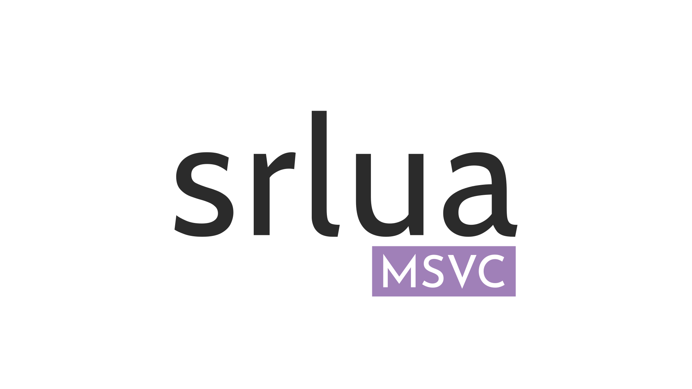

[]()


[](https://opensource.org/licenses/MIT)

Modified version of **[srlua]** for **MSVC** (v145) using version 5.4 of Lua.

Quote from the original README:

> This is a self-running Lua interpreter. It is meant to be combined with
> a Lua program  into a single, stand-alone program that  will execute the
> given Lua program when it is run.

> The command-line  arguments will be  available to  the Lua program  in a
> table called "arg" and also as '...'. All standard Lua libraries will be
> available too.  If you want  to use a  different set of  libraries, just
> copy linit.c from the Lua source, add it to srlua.c, and edit loadedlibs
> and preloadedlibs to suit your needs (lualibs in Lua 5.1).

### Usage

After building the **VS Solution** you'll find all binaries inside the `dist/`
folder, to create your own binaries from a Lua script just do:

```sh
srglue srlua.exe prog.lua prog.exe
```

Where `prog.lua` is your **main** lua script (it can be a luac file too) and
`prog.exe` is the output binary.

# Contributions

Feel free to leave your contribution here, I would really appreciate it!
Also, if you have any doubts or troubles using this tool just contact me or leave an issue.

[srlua]: https://web.tecgraf.puc-rio.br/~lhf/ftp/lua/#srlua
